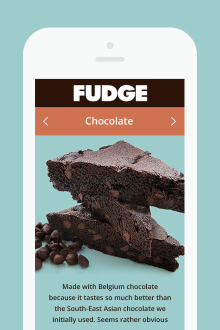

I think my portfolio should be a website with my own style and characteristics. First of all, I conceived the overall style of the website. I like to be concise, clear, and unique, which will make people impressive. I think this is very important for me as a novice in the design industry. After drawing a draft on paper, whichi was the first step had been to lay the foundation, then the typesetting, color and other specific details to polish it.

When I designing, the only problem that puzzled me was that the color selection and overall layout were more lively. So I was worried that it would make people feel a little unstable. I consulted the design teacher, and he replied that there was no problem, ao ahead. Then I did feel at ease and firm my own design style.

In the web development stage, there were actually many difficulties. First of all, I was not familiar with Boostrap. This is the first time I use Boostrap to write a website independently. I spent much time on reading a lot of tutorials about Boostrap both in Chinese and English, and then looking for codes that match the desired style one by one. This was really a learning process.

What annoys me the most was that on the graphic design page, the order of the pictures was not always adjusted properly. This was the page probably the longest time I spent. I didn't do it in the evening in the first day, so I continued to work the next two day. I did not have a clue, so I look up information online or find similar solutions on forums. While exploring and adjusting, I finally made a layout that I was more satisfied with.

By writing the code of my own portfolio, I have a deeper understanding of Boostrap, and I think it will be easier to do in the future.

A List of Any Assets or Resources I Used That Was Not My Own:

Font of # Heading level 1
        ## Heading level 2
        ### Heading level 3
        #### Heading level 4
        ##### Heading level 5
        ###### Heading level 6
        body texts
Framework of the image and Resume texts on About Page
